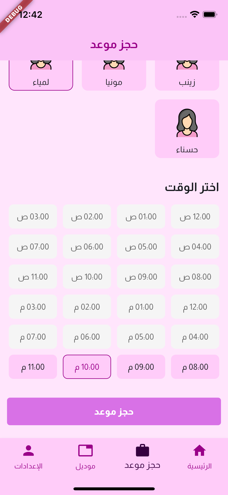
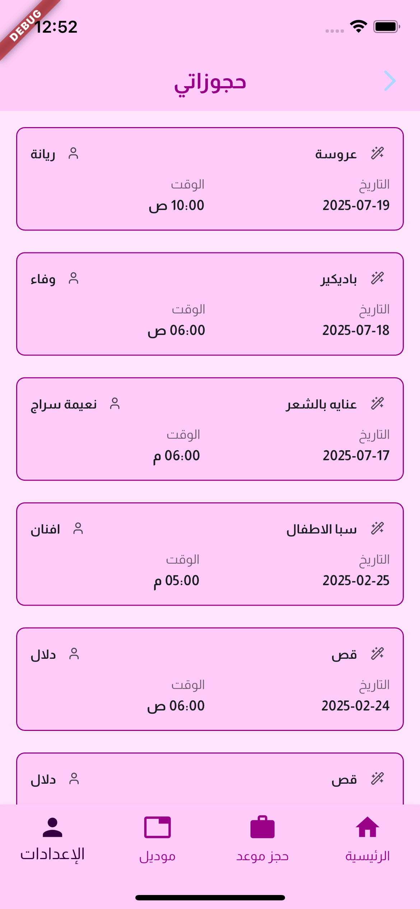

# flutter_salon_app

A new Flutter project.

https://www.youtube.com/shorts/QCDxWTQvI1s


###






# Salon - Flutter Application


A Flutter application for managing salon appointments and services.

## Features

- User-friendly interface for salon services
- Appointment scheduling system
- Service catalog with images
- User authentication
- Responsive design for various screen sizes
- Image carousels for showcasing salon work
- Date timeline for appointment selection

## Packages Used

- **State Management**: `provider`
- **Dependency Injection**: `get_it` 
- **Routing**: `go_router` 
- **HTTP Client**: `dio`
- **Local Storage**: `shared_preferences` 
- **Image Handling**: 
  - `cached_network_image` 
  - `image_picker`
- **UI Components**:
  - `carousel_slider`
  - `pin_code_fields`
  - `easy_date_timeline` 
  - `lucide_icons`
- **Utilities**:
  - `intl`  for internationalization

## Installation

1. Ensure you have Flutter installed. If not, follow the [official installation guide](https://flutter.dev/docs/get-started/install).

2. Clone this repository:
    ```bash
    git clone https://github.com/mahmoud-abdelnour/flutter-salon-app.git

3. Navigate to the project directory:
    ```bash
    cd flutter-salon-app

4. Install dependencies:
    ```bash
    flutter pub get

5. Run the app:
    ```bash
    flutter run
